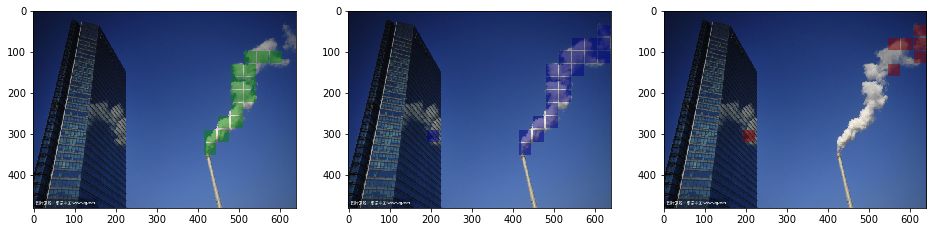
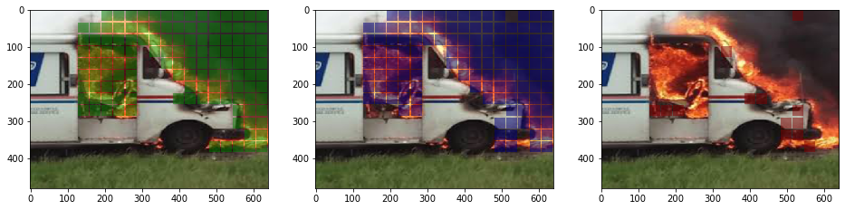
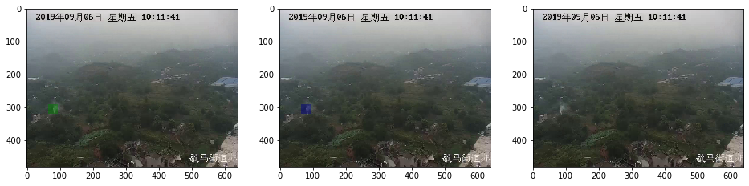

# Fire & Smoke Detection with CNN

There're 2 experiments in this repo.  
   1. Split image into 40x40 pixel crops, use resnet-101 to classify each of the crops. This classifier mainly depends on (local) texture features. This method works poorly for natrue pictures, with lots of false positives on clouds, shadows, reflections.. But it should be good for simpler situations (eg. detect fire and smoke in a factory). This model is super easy to train, and the best score threshold is exactly 0.5 since we have balanced batch sampler.  
   2. Directly use resnet-101 layer_4 output, add a linear head for pixel classification (we call this model slicenet). This model depends on texture features as well as global features, so false positives are much fewer. It's similar to segmentation but I created balanced pixel loss, so it's very easy to train, and the best score threshold should be around 0.5.  

Data preparation:  
Place ```images``` and ```masks``` under ```root_path```, png images and masks are supported.  
There are some preparation tools in ```data-preprocessor.ipynb```.  

To train split experiment:  
```
python train.py --root_path /data/fire --lr 1e-6 --scheduler_step 10 --train_name slice --train_id 01 --epochs 12 --slice_size 40 --pos_thres 0.1 --neg_thres 0.01
```
Crop size is 40px. If a crop contains 10% target pixels it'll be considered as positive, if target pixels are less than 1% it'll be considered as negative.

To train slicenet experiment:  
```
python train-slice.py --root_path /data/fire --lr 1e-5 --scheduler_step 175 --train_name slicenet --train_id 01 --epochs 250 --attention cbam --channel_r 16 --spartial 7
```

Both trainers support ```--help``` parameter to show usages.  
Start tensorboard with ```tensorboard --logdir ./logs/[train_name]_[train_id]``` to review training loss and metric.

Use ```visualize-*.ipynb``` notebooks to infer and visualize results.  

Some slicenet results (green, blue, red - gt, prediction, error):  


